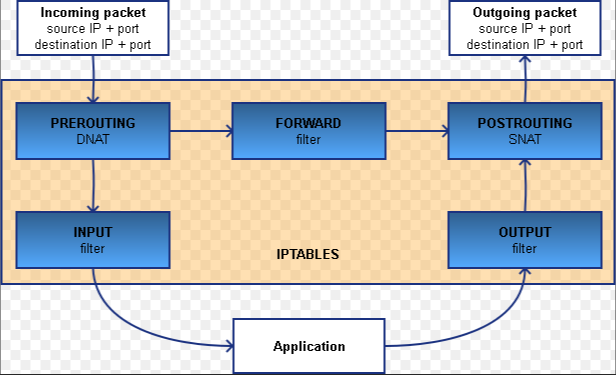

配置`iptables`端口转发，实现访问内网服务器的功能，同时对相关原理进行梳理。

<!--more-->

# 场景描述

首先描述一下我遇到的场景：客户端需要通过公网IP连接（SSH）多台远程服务器，但公网IP只有一个。最粗暴的方法就是想连哪台服务器就将公网IP绑定到哪台上，但这样会有重复劳动。同时对于客户端来说是同一个连接配置，很容易搞混。另外还有个做法是把绑定公网IP的服务器作为跳板机，每次先登录跳板机，再通过跳板机登录其他内网服务器。这想法是正确的，但做法上比较原始，同时如果遇到需要传输文件的场景就比较麻烦了。

在此场景下，很容易想到一个名词`反向代理`，想到反向代理，就想到`Nginx`。但很不幸，`Nginx`反向代理的是应用层协议（即HTTP协议）（Nginx其实也可以代理TCP，但需要加模块），而我们想要的是传输层协议（TCP、UDP协议）。

这时就轮到`iptables`登场了。关于`iptables`是什么，可以自行搜索，可以肤浅的认为就是个防火墙，可以配置一系列的入站出站规则。当然它的功能远不止这些。下面就详细介绍一下怎么样使用`iptables`实现类似反向代理的功能。

# 配置步骤

为了便于说明，我们先将上述场景具体化。场景中包含三个部分，分别是：客户机A、绑定公网IP的服务器B和内网服务器C。大致示意图如下：

```
+-----------+             +-----------+      +-----------+
|           |             |           |      |           |
|  客户机A  +------------>+  服务器B  +----->+  服务器C  |
|           |             |           |      |           |
+-----------+             +-----------+      +-----------+
                          公 网 IP：          内 网 IP：
                          66.42.69.230        192.168.0.101
                          内 网 IP：
                          192.168.0.100
```

下面开始进行配置

1. 开启转发功能

    ```sh
    echo 1 > /proc/sys/net/ipv4/ip_forward
    ```

1. 配置iptables

    ```sh
    iptables -t nat -A PREROUTING -d 192.168.0.100 -p tcp --dport 9022 -j DNAT --to-destination 192.168.0.101:22
    iptables -t nat -A POSTROUTING -d 192.168.0.101 -p tcp --dport 22 -j SNAT --to-source 192.168.0.100
    iptables -I FORWARD 1 -d 192.168.0.101 -p tcp --dport 22 -j ACCEPT
    iptables -I FORWARD 2 -s 192.168.0.101 -p tcp --sport 22 -j ACCEPT
    service iptables save
    service iptables restart
    ```

    对于第一条命令，需要说明一下：如果服务器B是使用的是双网卡，一个内网地址，一个公网地址的，需要将-d后面的IP地址改成公网IP。

经过以上配置，最终效果就是客户端通过`66.42.69.230:9022`即可连接上内网的服务器C，如果有多台内网服务器，参照以上命令再配置即可。

# 命令解析

配置讲完了，让我们再深入一下，看看这些命令的作用是什么。

首先，我们要从iptables的角度了解一个数据包到达服务器B后需要经历那些过程，以下是我从网上找的比较容易理解的一张图



第一条命令

从图上可以看出数据包首先进入的是PREROUTING，而第一条命令正是在这个阶段进行了处理。具体作用就是将目标地址为`192.168.0.100:9022`的数据包中的目标地址改为`192.168.0.101:22`，这样可以实现将此数据包通过路由转发到内网服务器C上。

第二条命令

结合图可以看到是对数据包出去的最后一步是POSTROUTING进行处理。具体作用是将目标地址为`192.168.0.101:22`的数据包的源地址修改为`192.168.0.100:随机端口号`。为什么要这样做呢？我们知道通信是双向的，要有来有回。试想一下，如果不修改源地址，那返回的数据包会不经过服务器B，直接发给客户端A，而这条路其实是不通的，导致通信失败。

第三、四条命令

我们看到，数据包在PREROUTING处有两条路可以走，具体规则是如果数据包目标地址是本机地址，则走INPUT进行内部处理；如果数据包目标地址不是本机地址，则走FORWARD转发到外部。而我们的场景由于修改了目标地址，所以走的是FORWARD。默认情况下FORWARD会有一条拒绝所有地址访问的规则，所有要想我们的请求可以通过，需要在这个条件之前添加通过的规则，具体规则就是目标地址是`192.168.0.101:22`可以通过，源地址是`192.168.0.101:22`的可以通过（猜测用于回包）。

第五、六条命令

以上设置的iptables规则只是在内存中，一旦重启就会失效。为此需要将规则保存到配置文件中。至于重启命令，可有可无。
